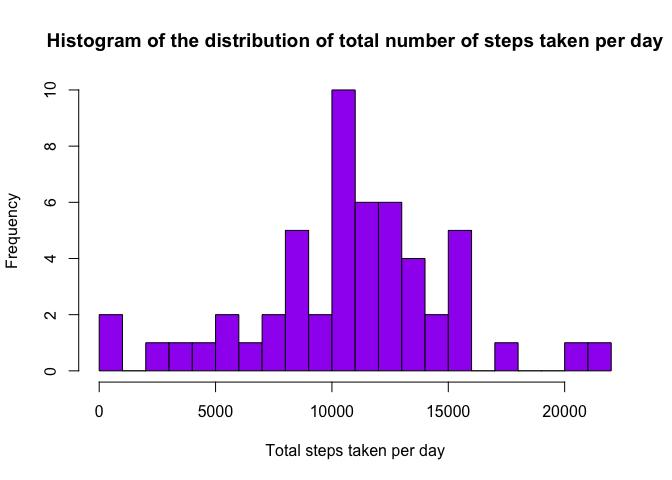
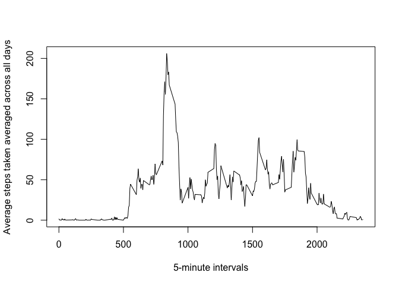
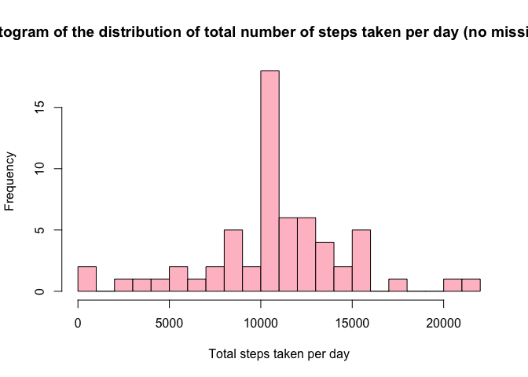
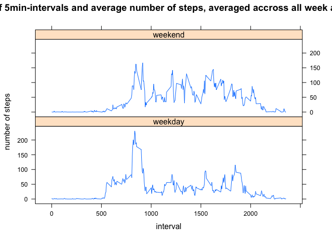

# Reproducible Research: Peer Assessment 1


## Loading necessary libraries


```r
library(knitr)
opts_chunk$set(echo=TRUE)
```

## Set the working directory


```r
setwd("/Users/Stefania/Desktop/RepData_PeerAssessment1")
```

## Loading and preprocessing the data

- First, we load the data


```r
cls = c("integer", "character", "integer")
data <-read.csv("activity.csv", head=TRUE, colClasses = cls, na.strings = NA)
head(data)
```

```
##   steps       date interval
## 1    NA 2012-10-01        0
## 2    NA 2012-10-01        5
## 3    NA 2012-10-01       10
## 4    NA 2012-10-01       15
## 5    NA 2012-10-01       20
## 6    NA 2012-10-01       25
```

-  then we pre-process the data in order to clean it


```r
data$date <- as.Date(data$date)
dataClean <- subset(data, !is.na(data$steps))
head(dataClean)
```

```
##     steps       date interval
## 289     0 2012-10-02        0
## 290     0 2012-10-02        5
## 291     0 2012-10-02       10
## 292     0 2012-10-02       15
## 293     0 2012-10-02       20
## 294     0 2012-10-02       25
```

## What is mean total number of steps taken per day?

- create the histogram of the total steps taken each day


```r
daySum <- tapply(dataClean$steps, dataClean$date, sum, na.rm = TRUE, simplify = T)
daySum <- daySum[!is.na(daySum)]

hist(x=daySum, 
     col = "purple", 
     breaks = 20, 
     xlab = "Total steps taken per day",
     ylab = "Frequency",
     main = "Histogram of the distribution of total number of steps taken per day")
```

 

- calculate the mean of the total steps taken each day


```r
mean(daySum)
```

```
## [1] 10766.19
```

- calculate the median of the total steps taken each day


```r
median(daySum)
```

```
## [1] 10765
```

## What is the average daily activity pattern?

- Make a time series plot (i.e. 𝚝𝚢𝚙𝚎 = "𝚕") of the 5-minute interval (x-axis) and the average number of steps taken, averaged across all days (y-axis)


```r
avgData <- tapply(dataClean$steps, dataClean$interval, mean, na.rm = TRUE, simplify = T)
avgDataFrame <- data.frame(interval=as.integer(names(avgData)), avg=avgData)

with(avgDataFrame, plot(interval,
                        avg,
                        type = "l",
                        xlab = "5-minute intervals",
                        ylab = "Average steps taken averaged across all days"))
```

 

- calculate the 5-minute interval, on average across all the days in the dataset that contains the maximum number of steps


```r
maxSteps <- max(avgDataFrame$avg)
avgDataFrame[avgDataFrame$avg == maxSteps, ]
```

```
##     interval      avg
## 835      835 206.1698
```


## Imputing missing values

- calculate the total number of missing values


```r
sum(is.na(data$steps))
```

```
## [1] 2304
```

- fill in the missing values. 
The missing value of a 5-minute interval is filled with the mean value of that interval

- create new dataset equal to the origina but with the missing values filled in


```r
dataImpute <- data
x <- is.na(dataImpute$steps)
avgData <- tapply(dataClean$steps, dataClean$interval, mean, na.rm = TRUE, simplify = T)
dataImpute$steps[x] <- avgData[as.character(dataImpute$interval[x])]
```

- create the histogram of the total steps taken each day


```r
newDaySum <- tapply(dataImpute$steps, dataImpute$date, sum, na.rm = TRUE, simplify = T)

hist(x=newDaySum,
     col = "pink",
     breaks = 20,
     xlab = "Total steps taken per day",
     ylab = "Frequency",
     main = "Histogram of the distribution of total number of steps taken per day (no missing data")
```

 

- calculate the mean of the total steps taken each day


```r
mean(newDaySum)
```

```
## [1] 10766.19
```


- calculate the median of the total steps taken each day


```r
median(newDaySum)
```

```
## [1] 10766.19
```


## Are there differences in activity patterns between weekdays and weekends?

- Create a new factor variable in the dataset with two levels – “weekday” and “weekend” indicating whether a given date is a weekday or weekend day.


```r
whatDay <- function(d){
        wd <- weekdays(d)
        ifelse(wd == "Saturday" | wd == "Sunday", "weekend" , "weekday")
}

day <- sapply(dataImpute$date, whatDay)
dataImpute$day <- as.factor(day)
head(dataImpute)
```

```
##       steps       date interval     day
## 1 1.7169811 2012-10-01        0 weekday
## 2 0.3396226 2012-10-01        5 weekday
## 3 0.1320755 2012-10-01       10 weekday
## 4 0.1509434 2012-10-01       15 weekday
## 5 0.0754717 2012-10-01       20 weekday
## 6 2.0943396 2012-10-01       25 weekday
```

- Make a panel plot containing a time series plot (i.e. 𝚝𝚢𝚙𝚎 = "𝚕") of the 5-minute interval (x-axis) and the average number of steps taken, averaged across all weekday days or weekend days (y-axis). See the README file in the GitHub repository to see an example of what this plot should look like using simulated data.


```r
wdata <- aggregate(steps ~ day + interval, data = dataImpute, FUN = mean)

library(lattice)
xyplot(steps ~ interval | factor(day),
       layout = c(1,2),
       xlab = "interval",
       ylab = "number of steps",
       main = "Time-series plot of 5min-intervals and average number of steps, averaged accross all week and weekend days",
       type = "l",
       lty = 1,
       data = wdata)
```

 
